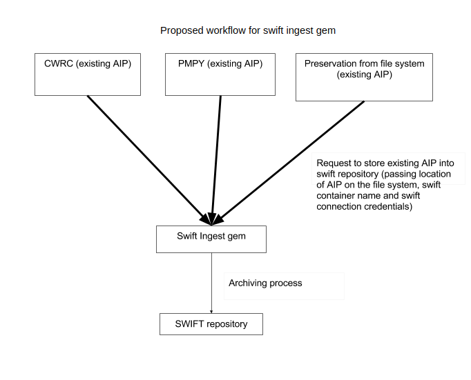

# SWIFT ingest Ruby gem
Ruby gem for storing files in swift openstack storage



## Requirements

Swift_Ingest supports Ruby 2.3.1+

## Installation

Swift_Ingest is hosted on rubygems.org. Therefore it can be installed via:

```bash
  gem install swift_ingest
```

## Usage

This gem in indented to be used from other ruby programs.
Typical usage involves creating new SwiftIngest object

```bash
  swift_depositer = SwiftIngest::Ingestor.new(username: 'user',
                                              password: 'secret',
                                              tenant: 'test',
                                              auth_url: 'http://www.example.com:8080/auth/v1.0',
                                              project: 'MYPROJ')

```

then using newly created oject to deposit object into swift repository:

```bash
  swift_depositer.deposit_file(myfile_file, 'MY_CONTAINER')
```
## Testing

To run the test suite:

```bash
  bundle install
  bundle exec rake
```

This will run both rspec and rubocop together.

To run rspec by itself:

```bash
  bundle exec rspec
```
To run rubocop by itself:

```bash
  bundle exec rubocop
```
